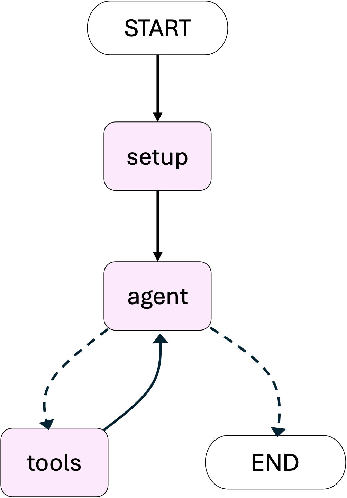

# 見積りエージェント

# 概要
このディレクトリでは、ソフトウェアやデザインなどのプロジェクト見積りを自動的に生成・改善するためのエージェントを構築します。
主にPydanticで定義されたスキーマと、Amazon Bedrock を利用したLLM 呼び出しを組み合わせ、以下のようなフローで見積りを作成・改善します。



# ディレクトリ構成

```
.
├── schema.py
├── utils.py
├── main.py
├── past_quotations/
│   └── ...（過去の見積りが格納されているディレクトリ）
└── README.md（本ドキュメント）
```

各ファイルの役割は以下のとおりです。

## schema.py
- 見積りで使用するデータ構造を定義するスキーマ群 (Risk, Task, Phase, Project)
- 見積り生成用ツールの仕様を返す関数 (get_project_quotation_tool)

## utils.py
- 見積り生成やテキストからの埋め込み（ベクトル化）などの共通処理
- 具体的には以下のような機能を提供
    - generate_quotation: LLMを呼び出し、Projectスキーマ準拠のJSONデータを生成
    - text_to_embedding: テキストをEmbeddingに変換

## main.py
- エージェントのワークフローを定義

## past_quotations/
- 過去の見積りファイル (PDF, XLSXなど) が格納されるディレクトリ


# ファイル詳細

## schema.py
このファイルには、見積り生成時に使用するデータ構造を管理するためのクラスが定義されています。以下の4つのクラスで見積りのスキーマを定義しています。

### 1. Risk
- プロジェクトを進める上で考えられるリスクを表すモデル
- フィールド:
    - riskName: リスクの名称
    - riskDescription: リスクの詳細説明
    - riskLevel: リスクのレベル (任意: 'Low', 'Medium', 'High' など)

### 2. Task
- プロジェクト内の個々のタスクを表すモデル
- フィールド:
    - taskName: タスク名称
    - taskDescription: タスクの詳細
    - estimatedEffort: タスク完了までの工数
    - risks: 当該タスクに関連するリスクのリスト

### 3. Phase
- プロジェクトを大きな区分ごとに管理するためのフェーズモデル
- フィールド:
    - phaseName: フェーズ名称
    - phaseDescription: フェーズ概要 (任意)
    - tasks: フェーズに含まれるタスクのリスト

### 4. Project
- プロジェクト全体を表すルートのモデル
- フィールド:
    - projectName: プロジェクト名称
    - phases: フェーズのリスト
    - overallRisks: プロジェクト全体に影響するリスクのリスト
    - description: プロジェクトの詳細説明


## utils.py
main.py 内で使うための関数群を定義しています。

### 1. generate_quotation
- LLMにプロンプトを送り、Projectスキーマに準拠する見積り(Quotation)情報をJSON形式で受け取る関数
- 引数:
    - client: Amazon Bedrockクライアント
    - prompt: 見積り作成のための指示文
    - files (Optional): 参照するファイルパスのリスト
- 戻り値:
    - Projectスキーマ形式のJSON文字列

### 2. text_to_embedding
- テキストをBedrockの埋め込みモデルで数値ベクトルに変換する関数
- 引数:
    - client: Amazon Bedrockのクライアント
    - text: 埋め込みを取得したいテキスト
- 戻り値:
    - 浮動小数点数のリスト（Embedding）


## main.py
このファイルで、エージェントのワークフローを定義し、見積りエージェントを実行させます。大まかなフローは[概要](##概要)に記載の図の通りです。

### 1. setupノード
workflowで使用するstateの初期化を行います。
- ユーザーの指示から明確な目標の設定
- 見積りの初期生成

### 2. agentノード
ReActアーキテクチャに似た流れで、以下の処理を行います。
1. 現状の見積もりに対する改善プランの作成
2. ユーザーへのリフレクション
3. 2を受けて，改善プランの再作成

### 3. toolsノード
以下の2つのツールを使用することができます。
- improve_quotation_with_internet関数
    1. 現在の見積もりとその改善プランをもとに検索クエリを生成
    2. 検索
    3. 検索結果をもとに見積りを改善

- improve_quotation_with_past_comparisons
    1. 見積もりから類似見積もりを抽出
        - Amazon Titan Text Embeddings V2でembedding変換
        - cosine類似度で類似ドキュメントを抽出
    2. 抽出した見積りをプロンプトを参考に，現在の見積りを改善
